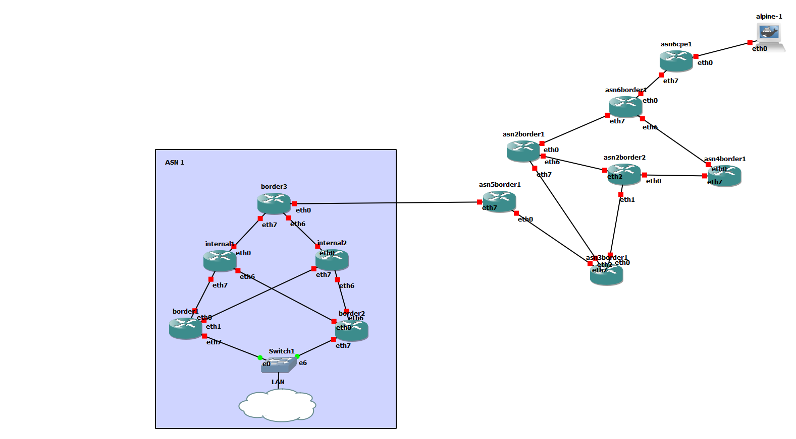

# gns3-bgp-frr
A lightweight GNS3 BGP lab using FRR docker containers and Python automation

## Topology

## Setup

* gns3 > edit > preferences > docker containers > add a new one
  * name: `docker-frrouting-frr-8.2.2`
  * image: `frrouting/frr:v8.2.2`
  * adapters: `8`
* Add another
  * name: `alpine`
  * image: `alpine`
  * adapters: `1`
* Set up the topology like the above. TODO: automate this (how big is a portable project?)
* Copy `example.env` to `.env` and fill out
* Create a virtual environment and activate it
  * `python -m venv env`
  * (Windows) `env/scripts/activate.ps1`
* TODO: run the configuration script