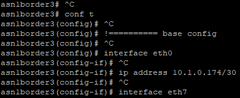

# gns3-bgp-frr

A lightweight GNS3 BGP lab using Free Range Routing docker containers and Python automation, with external connectivity. Addresses are automatically assigned to links, configs are generated and applied.

Control the entire simulation from the commandline, break it manually and reset it, or extend it with your own commands.

## Topology


## Commandline

Control is via subcommands and options sent to `manage.py`.


Usage: `python manage.py <global options> <command> <command options>`

## Base Setup

* [Install GNS3 and the GNS3 VM](https://docs.gns3.com/docs/getting-started/installation/windows)
* Open GNS3 > edit > preferences > docker containers > add a new one
  * name: `docker-frrouting-frr-8.2.2`
  * image: `frrouting/frr:v8.2.2`
  * adapters: `8`
  * advanced > additional persistent directories: `/etc/frr`
    * if you can't find this during template creation, create the template then right click > edit it
* Add another
  * name: `alpine`
  * image: `alpine`
  * adapters: `1`
* File > import portable project > import `project.gns3project`
  * If the  import doesn't work, manually create the topology like the above
* Clone/download this project and open a PowerShell (or other) shell in the folder
* Copy `settings.example.py` to `settings.py` and fill out
* Create a virtual environment and activate it
  * `python -m venv env`
  * (PowerShell) `env/scripts/activate.ps1`
* Install dependencies
  * `pip install -r requirements.txt`

## Usage

### Start nodes


* Make your GNS3 and shell windows both visible
* Run `python manage.py start-all`
* Look at GNS3 - all the nodes should be starting

### Set up services


* Open an aux console to any FRR node
* Run `python manage.py set-up`
* Watch the console - the config file should be updated
* Once `set-up` finishes, re-open the console and run `ps -a`. You should see `ospfd` and `bgpd` running.
  * If not, run `set-up` again or restart GNS3

### Generate addresses and configs


* Run `python manage.py generate-configs`.
* Review the configs in the `generated/` folder
  * You should see subnets within the supernet you assigned in `settings.py` and external addressing for `asn1border` `1` and `2`
  * OSPF and iBGP will be configured for `asn1` routers
  * eBGP will be configured for border routers

### Apply configs




* Open an aux console to any FRR node
* Run `python manage.py apply-configs`
* Watch the console - the config should be applied through `vtysh`'s config mode
* Check the GNS3 GUI - all interface labels should now show IPs

**Note**: router IDs in OSPF and BGP are `0.type.asn.num`, for easier understanding. GNS3 doesn't allow changing the router labels from their hostname though. `type` is 0 for border routers, 1 for internal, 2 for CPE. `asn` is asn and `num` is the last number in the hostname. So e.g. `asn1border3` has a router ID of `0.0.1.3`.

At this point `alpine-1` should be able to ping `asn1border1`.

## External Connectivity

### BGP

**Note**: this uses public AS numbers (1-6) for simplicity. Don't use the BGP method with a device that's peering with other real public ASes.

If your external gateway can run BGP, you can configure it to peer with `asn1border1` and `2` on the IPs you set in `settings.py`. Advertise a default route and configure firewalling/NAT to allow internet connectivity. Remember you might have to apply distribution lists if your device conforms to RFC 8212.

FortiGate BGP example (required firewall and NAT rules omitted):

<details>
  <summary>Click to expand</summary>

```fortigate
config router access-list
    edit "distribute-all"
        config rule
            edit 1
                set prefix any
            next
        end
    next
end
config router bgp
    set as <EXTERNAL_GATEWAY_ASN from settings.py>
    set router-id <id>
    config neighbor
        edit "<ASN1BORDER1_EXTERNAL_IP from settings.py>"
            set distribute-list-in "distribute-all"
            set distribute-list-out "distribute-all"
            set remote-as 1
        next
        edit "<ASN1BORDER2_EXTERNAL_IP from settings.py>"
            set distribute-list-in "distribute-all"
            set distribute-list-out "distribute-all"
            set remote-as 1
        next
    end
    config redistribute "connected"
        set status enable
    end
    config redistribute "static"
        set status enable
    end
end
```

</details>

### Static route

If you don't have external BGP you might be able to get basic external connectivity with static routes. Create static routes on your `EXTERNAL_GATEWAY` device that route `P2P_SUPERNET` to `ASN1BORDER1_EXTERNAL_IP` and `ASN1BORDER2_EXTERNAL_IP`. Note that a lot of basic home modem/routers will only NAT their immediate local LAN subnet so you might not get internet connectivity from `alpine-1` with this option.

## Testing

Pytest is used.

Run tests with `python manage.py test` assuming gns3 is configured correctly.

If not, run tests with `pytest --no-header --tb=line -rA` which will allow testing gns3 without trying to load dependencies first.

Add additional tests to the `tests` folder.

## Troubleshooting

* `telnetlib` is occasionally throwing errors. Sometimes it'll print a stack trace other times it'll abort so rich-click prints `Aborted`. Stop and start all nodes if it happens then run the step again. If it's still no good restart the GNS3 server. Might be related to CPU on the GNS3 server.

## Misc notes

* Thought I was losing my mind before I found this: FRR 7.4+ requirements have changed for BGP.
  * You have to define an out filter to send routes and an in filter to receive them (I knew this one),
  * But ALSO now set [`no bgp network import-check`](https://docs.frrouting.org/en/latest/bgp.html#clicmd-bgp-network-import-check) to allow advertising routes that aren't in the local routing table (I assumed it was still the original behaviour). What threw me is that `show ip bgp all` on the local router still listed the routes.
* Debugging FRR:

```sh
mkdir -p /var/log/frr
touch /var/log/frr/debug.log
chmod 666 /var/log/frr/debug.log
vtysh
 conf t
  log file /var/log/frr/debug.log
  # check and enable what you need to
  debug ?
```

* You need to call `node.get_links()` before `node.links`
* In FRR you have to create the prefix list before specifying it in the BGP config if you want all the routes to work immediately. It'll apply the other way, but you'll be missing some BGP routes and only clearing the session or restarting fixes it.
* ASN 1 peers iBGP on interface IPs for lab simplicity. If you're feeling fired up there's a bunch of TODOs further down that would be good lab extension tasks.
* border routers advertise connected transit links instead of other simulated networks for lab simplicity.
* You can't change GNS3 node labels (even in the GUI), they always reflect the hostname. This is why `node.update(label=new_label_dict)` doesn't work.

## TODO

These would also be good lab extension tasks.

* Clean up iBGP / OSPF interaction
* Generate and peer on loopbacks
* Advertise other networks from each asn border router, no connected transit links
* Write a test for internet connectivity from alpine-1
* Automate and write tests for traffic engineering scenarios: prefer longer paths etc.
  * Could have a `scenario` command with subcommands for each scenario. Same with tests.