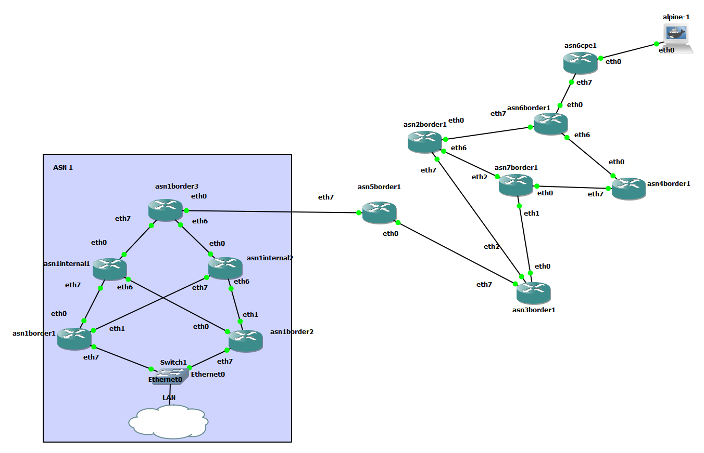

# gns3-bgp-frr

A lightweight GNS3 BGP lab using FRR docker containers and Python automation. Addresses
are automatically assigned to links, configs are generated and applied.

Control the entire simulation from the commandline, break it manually and reset it, or
extend it with your own commands.

## Topology

## Setup

* [Install GNS3 and the GNS3 VM](https://docs.gns3.com/docs/getting-started/installation/windows)
* Open GNS3 > edit > preferences > docker containers > add a new one
  * name: `docker-frrouting-frr-8.2.2`
  * image: `frrouting/frr:v8.2.2`
  * adapters: `8`
* Add another
  * name: `alpine`
  * image: `alpine`
  * adapters: `1`
* Set up the topology like the above. TODO: automate this (how big is a portable project?)
* Clone/download this project and open a powershell window
* Copy `settings.example.py` to `settings.py` and fill out
* Create a virtual environment and activate it
  * `python -m venv env`
  * (PowerShell) `env/scripts/activate.ps1`
* Install dependencies
  * `pip install -r requirements.txt`
* run `python manage.py start-all`

## Controlling

Control is via subcommands and options sent to `manage.py`.

Usage: `python manage.py <global options> <command> <command options>`